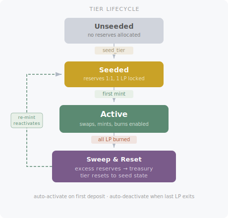

# Tiers

Tiers are the core concept that makes STAMM different from a standard AMM. Each tier is an independent constant-product market with its own reserves, fee rate, and LP token - but all tiers share the same asset pair and live inside the same contract.

## Why Tiers?

In a traditional AMM, all liquidity providers share the same fee rate. This creates a tension:

- **High fees** protect LPs from impermanent loss but make the pool uncompetitive for traders
- **Low fees** attract trading volume but expose LPs to more risk

STAMM resolves this by letting the market decide. LPs choose which fee tier to provide liquidity to based on their own risk/reward preferences. Traders choose which tier to swap through based on available liquidity and fee rates.

## All 6 Tiers

Every pool is created with all 6 tiers. LP tokens for all 6 are created during bootstrap. Four default tiers are seeded during the first liquidity deposit (`seed_and_mint`); the remaining two are seeded individually via `seed_tier`.

| Tier | Index | Fee Rate | Seeding | Intended Use |
|---|---|---|---|---|
| Tier 0 | 0 | 0.03% (3 bps) | `seed_tier` | Low-fee active trading |
| Tier 1 | 1 | 0.1% (10 bps) | Default | Standard trading |
| Tier 2 | 2 | 0.3% (30 bps) | Default | Medium-fee trading |
| Tier 3 | 3 | 1% (100 bps) | Default | Volatile pairs |
| Tier 4 | 4 | 3% (300 bps) | `seed_tier` | High-fee passive LP |
| Tier P | 5 | ~1 ppm (0.0001%) | Default | Protocol backstop |

## Tier Index Range

| Index | Role |
|---|---|
| 0-4 | Standard tiers with fixed fee rates |
| 5 | Tier P (passive tier, fixed 1 ppm fee) |

## Tier P (Passive Tier)

Tier P is a special tier at index 5 with unique properties:

- **Near-zero fee**: ~1 part per million (0.0001%), calculated as `max(1, amount / 1,000,000)` - the floor makes the effective rate higher for small amounts
- **No protocol fee extraction**: 100% of fees stay in the tier's reserves
- **Inline spill recipient**: Receives 10% of protocol fees from every swap via the inline spill mechanism
- **Backstop role**: Provides deep, low-cost liquidity as a baseline

Tier P is protocol-managed - it is not open to public LPs. Its liquidity is built through the inline spill redistribution mechanism, where a portion of fees from every swap are deposited into Tier P's reserves and LP tokens are minted to the treasury.

## Tier Lifecycle

### Seeding

A tier is seeded with 1 microunit of each asset (reserve_a = 1, reserve_b = 1, total_lp = 1). The 1 LP token is locked in the pool permanently. Seeding marks the tier as existing but not yet active for trading.

Default tiers (P, 1, 2, 3) are seeded during `seed_and_mint`. Non-default tiers (0, 4) are seeded individually via `seed_tier`.

### Auto-Activation

A tier automatically becomes active when its total LP supply exceeds 1 (the first real mint after seeding). Active tiers:

- Can be swapped through
- Can receive all mint types (standard, hybrid, single-sided)
- Are included in aggregate reserve calculations and the TWAP oracle
- Participate in the inline spill system

### Auto-Deactivation

A tier automatically becomes inactive when all user LP is burned and total LP returns to 1 (only the locked seed LP remains). On deactivation:

- The tier rejects all new swaps and mints
- Burns are always allowed (last LP can exit)
- Excess reserves beyond the seed state (1,1) are swept to treasury claims (`tr_a`, `tr_b`)
- The tier resets to seed state: reserve_a = 1, reserve_b = 1, total_lp = 1

This sweep-on-final-burn ensures no value is stranded in inactive tiers.

## Active Tier Tracking

Tier active states are packed into a single `tier_mask` bitmask (uint64). Bit `i` being set means tier `i` is active. This allows efficient active-tier checks without reading separate state keys per tier.

## Inline Spill Targeting

The protocol identifies the two weakest standard tiers (lowest k-values) inline during each swap. The scan covers all active tiers (excluding the current tier), with only standard tiers (0-4) eligible as weakest/second-weakest recipients. These tiers receive the majority of protocol fee redistribution via [inline spill](../features/fee-engine.md#3-inline-spill) (55% to the weakest, 35% to the second weakest).

## How Traders Choose a Tier

From a trader's perspective, the choice is straightforward:

- **Small trades**: Use the lowest-fee tier with sufficient liquidity
- **Large trades**: Use a tier with deep enough reserves to handle the trade without excessive slippage
- **Price-sensitive trades**: Compare output across tiers and pick the best one
- **Automatic**: Use the [smart-routed swap](../features/swaps-and-liquidity.md#smart-routed-swap) (`swap_smart`), which auto-routes across up to 3 tiers using waterfall routing for optimal execution

Frontend applications and SDKs can automate tier comparison. For manual tier selection, each swap executes on exactly one tier. The `swap_smart` method handles multi-tier routing automatically.

## How LPs Choose a Tier

From an LP's perspective:

- **Active LPs** may prefer lower-fee tiers that attract more volume, earning more total fees despite the lower rate
- **Passive LPs** may prefer higher-fee tiers, accepting less volume in exchange for less impermanent loss

Tier P is not available for public LP deposits - it is funded solely by the inline spill redistribution.

Each tier's LP token is a standard Algorand ASA, fully transferable and composable.
